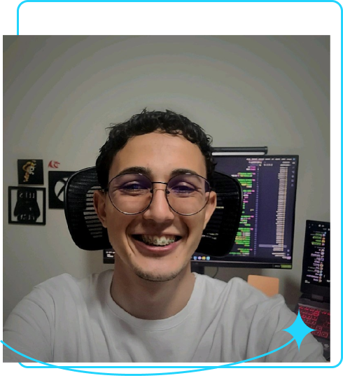

# Aula 3 - Projeto Final: Portfólio com HTML e CSS

## ✅ Conteúdos abordados

* [X] Estrutura básica de uma página HTML (`<!DOCTYPE html>`, `<html>`, `<head>`, `<body>`)
* [X] Organização do projeto em múltiplos arquivos (`reset.css`, `style.css`, `index.html`)
* [X] Importação e uso de fontes externas (Google Fonts)
* [X] Reset CSS moderno para padronização entre navegadores
* [X] Criação de layout com **Flexbox**
* [X] Aplicação de classes para organização de estilos
* [X] Estilização de links como botões de chamada para ação (Instagram e GitHub)
* [X] Inserção de imagem com `alt` descritivo
* [X] Paleta de cores com fundo escuro e destaques em azul
* [X] Estruturação semântica com `<header>`, `<main>`, `<section>` e `<footer>`

## 💡 Descrição da aula

Nesta aula desenvolvemos a primeira versão do  **projeto final: um portfólio pessoal** .

Organizamos os arquivos de forma modular, utilizando um `reset.css` para normalizar estilos e um `style.css` para definir a identidade visual.

A página foi construída com  **HTML semântico** , destacando:

* Uma seção de apresentação com  **título, parágrafo e imagem de perfil** .
* Dois links estilizados como botões direcionando para o **Instagram** e o  **GitHub** .
* Uso de **Flexbox** para alinhar texto e imagem lado a lado.

No CSS, foram aplicadas técnicas como  **fontes externas (Krona One e Montserrat)** , **cores de contraste** (fundo preto e texto branco),  **bordas arredondadas** , **espaçamentos proporcionais** e estilização de elementos (`span`, `hr`, `a`).

O resultado foi uma página inicial de portfólio funcional e visualmente organizada, servindo como base para evoluções futuras.

## 💻 Trecho de código aplicado

```html
<main class="apresentacao">
    <section id="sobre" class="apresentacao__conteudo">
        <h1 class="apresentacao__conteudo__titulo">Conectando informação, tecnologia e propósito para
            <span>impulsionar</span>
            seu negócio digital.
        </h1>
        <p class="apresentacao__conteudo__paragrafo">Olá! Sou Weslley Chaves, desenvolvedor em formação com foco em
            Back-end e Ciência de Dados. Tenho
            experiência em análise de requisitos e hoje aplico Python, SQL e Web para transformar ideias em soluções
            práticas. Vamos conversar?
        </p>
        <div class="apresentacao__links">
            <a class="apresentacao__links__link" href="https://www.instagram.com/weslley_ch4ves/"
                target="_blank">Instagram
            </a>
            <a class="apresentacao__links__link" href="https://github.com/Weslley-Chaves/Weslley-Chaves"
                target="_blank"> GitHub
            </a>
        </div>
    </section>
    
</main>
```
